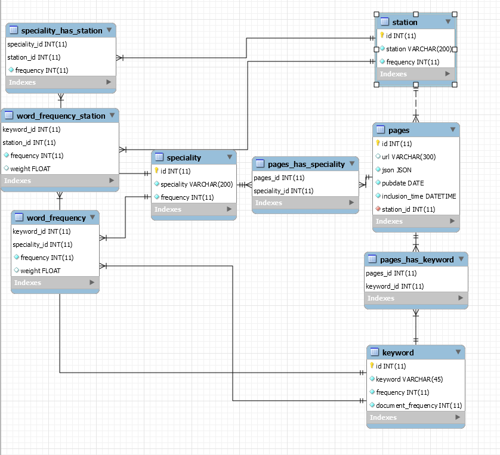

# 高校大数据系统

本项目分析了大学应届生就业和招聘数据。通过爬取收集应届生招聘网站上的数据，分析市场对于每个专业学生，每个岗位的需求然后汇总成图表展示出来。学生和教师便可以看着这些图表，从实际出发，以市场需求为导向进行学习和教学。对于高校教学和学生的学习有一定的指导作用。

【关键词】：教学 学习 就业 数据

## 制作成员名单

主体：王超逸

数据爬取和处理：邢博

文档整理：李嘉耀

导师：唐姗

## 软件功能

 1、统计各专业和各职位需求量。统计热门专业，并用图表展示热度

 2、统计一个专业有哪些职位，一个职位招哪些专业，并用图表展示比例

 3、统计对于一个专业或一个职位有哪些要求（关键词），并用图表展示关键词权重

 4、根据关键词，职位或专业查询相对应的页面

## 主要模块

- 本项目通过爬虫爬取网页，提取页面中的信息，交给离线处理模块。

- 离线处理模块清洗数据，提取网页中的关键词，算出每个关键词的权重和频数，记录这个页面招收的岗位和专业信息并进行统计。

- 网页模块将数据从数据库中查出来，并整理成API提供给前端。

- 前端从后台得到数据然后绘制成图表。

## 数据库模式

## 技术细节

- 注意到很多表都有一个叫频数的字段，这是因为这些量在各种地方被使用，为了效率着想，所以存下来了。

- 关键词权重用的是log（逆文档指数*频率）
- 分词使用了广受好评的开源项目结巴分词
- 爬虫是随手写的，没有使用其他构架
- html语法分析使用了广受好评的beautifulsoup4库
- 数据清洗使用了一些词典结合一些正则表达式
- 网站使用flask框架，dao层使用sqlalchemy，模板渲染使用了jinja2
- 图表绘制使用了百度的开源图表库echarts